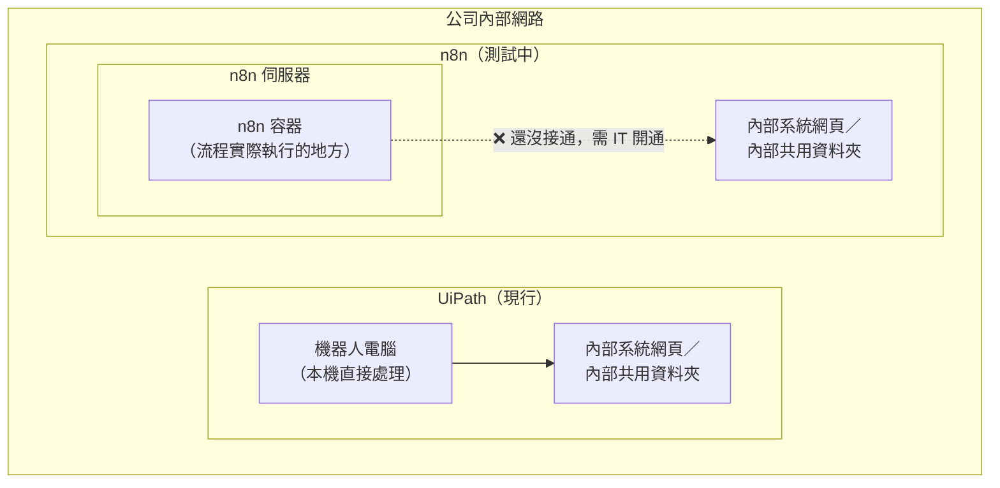

# n8n POC 測試發現與待驗證事項

> 本報告由測試與流程設計單位提出，目的是說明 n8n 在現階段 POC（概念驗證）測試中觀察到的狀況，作為評估 n8n 是否適合承接特定業務流程的參考。本單位僅負責測試與流程設計，系統環境的建置與開通仍需 IT／基礎架構單位配合。

---

## 一、報告目的

我們正在測試 n8n 這套新的自動化工具，看它是否能承接目前部分由 UiPath 執行的業務流程。測試過程中，我們發現幾個案例值得特別留意——**不是說 n8n 做不到，而是這些案例需要先具備一些條件，才能實際驗證可不可行**。本報告整理目前的觀察與後續需要的準備事項。

---

## 二、目前測試環境的準備度

在深入個別案例之前，先說明一個重要背景：**n8n 目前還沒有完全接通公司內部的網路與檔案空間**，這會影響我們能不能實際測試、而不是代表 n8n 這套工具做不到。

### 一眼看出差異：兩者架構對照



**白話解釋**：n8n 伺服器一樣是放在公司內部網路裡，不是跑到外面去，這點跟 UiPath 沒有不同。真正的差異在於「本機直接處理」跟「另一台伺服器處理」的不同：

UiPath 是直接裝在專門的機器人電腦上執行、本機直接處理，這台電腦要碰內部系統、內部檔案，本來就是自己在用的東西，不需要額外接通。

n8n 不一樣，它是跑在**另一台獨立的伺服器**上，而且流程實際上是在伺服器裡再包一層的「**容器**」中執行——可以想成伺服器裡另外隔出一個獨立的工作環境，n8n 的流程真正跑在這個容器裡面，不是直接跑在伺服器本身。就算伺服器同樣在內網，容器要碰到內部系統或資料夾，還是要另外設定連線路徑——這不是 n8n 這套工具本身的能力問題，而是**這條路目前還沒接上**，跟前面提到的三個案例是否可行，都要先等這條路通了才知道。

| 項目 | 狀態 |
|---|---|
| n8n 帳號與基本連線 | ✅ 已完成 |
| 熟悉平台基本操作 | 🔄 進行中 |
| 內部檔案空間開通（讓 n8n 能存取公司內部的檔案） | ⏳ 等待 IT 開通 |
| 內部系統網路開通（讓 n8n 能連到內部系統網頁） | ⏳ 等待 IT 開通 |

以下所有案例的驗證，都需要等這兩項開通後才能真正測試。**這是目前最優先需要 IT 協助的事項。**

### 這兩項要怎麼跟資訊單位說明

跟 IT 提需求時，籠統地說「幫我們開通儲存空間」「幫我們開通網路」，對方不容易判斷問題出在哪一層、該動哪個設定。我們實際用 n8n 測試過，已經有具體的錯誤現象可以直接附上，比較容易讓 IT 快速定位、加快處理：

| 需求              | 目前實測到的具體現象                                                     | 建議跟 IT 說的內容                                                                |
| --------------- | -------------------------------------------------------------- | -------------------------------------------------------------------------- |
| **檔案要能進出的儲存空間** | n8n 已經設定好一個檔案存取路徑，但這個路徑目前是空的，完全沒有實際空間可以用——類似「插座已經預留位置，但還沒接電」   | 請 IT 在 n8n 伺服器指定的路徑上，掛上一塊實際可讀寫的儲存空間，讓 n8n 處理檔案時有地方可以存取                     |
| **連到內部系統的網路**   | 實際測試連線行內同仁常用、確定沒有特殊限制的內部網站（`openwebui.feibdev.com.tw`）也得到「查無此網域」的結果，代表目前這台伺服器可能連最基本的內部網域都還沒涵蓋到，範圍比單一目標系統更大 | 想請教目前這台 n8n 主機的網路設定，已經涵蓋哪些內部網域範圍？方便提供 1-2 個目前應該連得到的網域或 IP，讓我們可以先實際測試確認 |

**提報建議**：
- 附上實測到的具體現象（如上表），比只說「連不到」「用不了」更容易讓 IT 判斷是哪個環節的問題。
- 明確說明「這兩項不是我們測試單位能自己處理的」，避免對方誤以為是操作方式錯誤而回覆「請檢查看看」。
- 建議正式送出工單或安排會議，一次講清楚這兩項需求，並詢問預計開通時程，方便我們安排後續案例的測試排程。

<details>
<summary>附錄：實測記錄（供 IT 參考核對）</summary>

- **測試時間**：2026/8/24 上午 10:29:56
- **n8n 版本**：2.21.5（Self Hosted）
- **測試目標**：`http://openwebui.feibdev.com.tw`
- **測試方式**：n8n 內建 HTTP Request 節點直接對該網域發出請求
- **錯誤訊息**：
  ```
  getaddrinfo ENOTFOUND openwebui.feibdev.com.tw
  ```
- **代表意義**：DNS 查詢失敗，這台 n8n 主機目前查不到這個網域對應的位址，尚未進到「網路通不通」的階段

</details>

---

## 三、案例觀察

我們挑了三個現有的 UiPath 流程作對照，這三個案例分別代表自動化工作中最常見的兩種核心任務：**抓取網頁上的資料**，以及**處理 Excel／文件資料**。

### 案例 1：財產申報檔授信資料檢核（抓取內部系統網頁資料）

**現行做法**：這支流程需要登入公司內部的查詢系統（iSmartWeb、iCare），依不同條件切換好幾種查詢畫面，把需要的資料抓下來做比對。

**觀察到的重點**：
- 這套內部系統本身在設計上，就需要**連續好幾個步驟、切換好幾個畫面**才能查到一筆完整資料，而且如果動作太快、太頻繁，可能會被系統擋下來或跑得不順。
- 現有 UiPath 文件裡也提到，這種頻繁切換畫面的做法其實**連現在都覺得效率不夠好**，正在討論怎麼優化。
- 換到 n8n 上時，同樣要面對「怎麼樣才能穩定地連續走完這麼多個查詢步驟」的問題，這不是 n8n 特有的問題，但需要重新設計、實際測試才會知道好不好用。

**需要先具備的條件才能驗證**：
1. n8n 要能連到公司內部網路，碰得到 iSmartWeb、iCare 這些系統（目前還沒開通）
2. 需要一組測試用的登入帳號權限

**目前結論**：技術上可行，但要等網路開通後才能實際測試順不順、穩不穩。

---

### 案例 2：自行查核檢核作業（處理舊版 Word／Excel 文件資料）

**現行做法**：這支流程要從系統下載一份舊版的 Word 檔案（`.doc` 格式），轉換成 Excel 格式，再跟另一份標準對照表逐項比對，總共有 15 項檢核規則。

**觀察到的重點**：
- 目前 n8n 所在的測試環境**沒有安裝 Office 軟體**，而這份檔案是比較舊的 Word 格式，需要額外的工具或方式才能把它轉成 Excel 可以讀的資料。這件事能不能做到、做起來準不準，需要實際拿一份範例檔案測試才會知道。
- 反過來說，**15 項規則的比對邏輯**，用 n8n 反而可能比 UiPath 更清楚好維護——這點是 n8n 相對有優勢的地方。

**需要先具備的條件才能驗證**：
1. 需要一份真實（或去識別化）的範例 `.doc` 檔案供測試轉檔
2. 可能需要 IT 協助確認能否在 n8n 環境安裝轉檔所需的工具

**目前結論**：資料比對邏輯這塊 n8n 應該做得不錯；檔案轉檔這塊能不能做到，需要實測才能確定。

---

### 案例 3：萬事達卡轉帳卡發卡業務統計申報（下載報表、處理 Excel、寄信彙整）

**現行做法**：每月從報表系統下載固定格式的 PDF 報表，加上一封固定格式的回覆信件，整理數字後填入 Excel 產出申報表。

**觀察到的重點**：
- 這類「下載固定檔案 → 讀取固定格式資料 → 填入 Excel」的工作，是目前看起來**n8n 最擅長、最沒有疑慮的類型**。
- 唯一的卡點跟系統本身無關，是前面提到的「內部檔案空間、內部系統網路還沒開通」這個共同前提。

**需要先具備的條件才能驗證**：
1. n8n 要能存取存放報表 PDF 的內部共用資料夾
2. n8n 要能連到報表系統或至少讀取已下載好的檔案

**目前結論**：預期可行度高，只待環境開通即可實測。

---

## 四、後續驗證需要的前提條件（總表）

| 前提條件 | 目前狀態 | 影響哪些案例 |
|---|---|---|
| n8n 連到公司內部網路（能碰到內部系統網頁） | ⏳ 等待 IT 開通 | 案例 1、案例 3 |
| n8n 能存取內部檔案共用空間 | ⏳ 等待 IT 開通 | 案例 3 |
| 測試用的系統登入帳號 | ⏳ 待申請 | 案例 1 |
| 範例 `.doc` 測試檔案 | ⏳ 待準備 | 案例 2 |
| 確認能否在 n8n 環境安裝轉檔工具 | ⏳ 待與 IT 確認 | 案例 2 |

---

## 五、總結建議

1. **目前的觀察還不是最終結論**，而是「這些案例需要先具備什麼條件，才能真正測出可不可行」的整理。
2. **網路與檔案空間開通是所有案例的共同前提**，建議優先請 IT／基礎架構單位協助處理，這會讓後續測試進度加快。
3. 三個案例分別代表不同類型的工作（網頁查詢資料、文件格式轉換、標準化報表處理），建議等環境開通後依序測試，逐步累積 n8n 適合承接哪些類型流程的具體證據。
